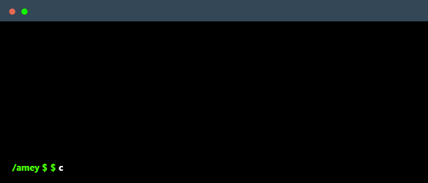

 

    

### Main skills

### Studying

### Connect with me!

    
    
    

### 
> [!PORTFOLIO]  
> <a href="https://amey-apankar.github.io/portfolio/" target="_blank">Check out my interactive portfolio here!</a>

